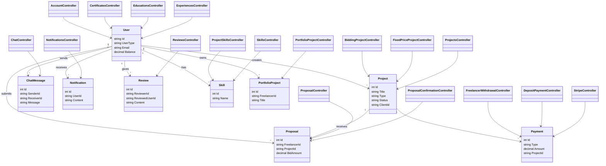

# Freelancing Platform (Angular & ASP.NET Core)

A full-stack freelancing platform connecting clients with freelancers, supporting bidding/fixed-price projects,With real time bidding, real-time chat, payments, and advanced role management.

## Key Features

### User Roles
- **Freelancers**: Create profiles, bid on projects, withdraw earnings, Apply for proposals, manage profile
- **Clients**: Post projects (fixed-price/bidding), Accept proposals, Check freelancers profile and contact them
- **Admins**: Moderate content, manage categories/skills, handle disputes  

### Core Functionalities
- **Project Marketplace**  
  - Bidding system with proposals  
  - Fixed-price projects with milestones  
  - Category/subcategory organization  

- **Payment System**  
  - Stripe integration for deposits/withdrawals  
  - Escrow payments for milestones  
  - Subscription plans for freelancers  

- **Real-Time Features**  
  - SignalR chat & notifications  
  - Live project updates for biddings 
  - Sentiment analysis on reviews using AI  

- **Profile Management**  
  - Portfolio projects with images  
  - Skill endorsements  
  - Education/certification tracking  

## Tech Stack

### Frontend
- **Angular 19** with TypeScript  
- **PrimeNG** Component Library  
- **RxJS** for state management  
- **SignalR Client** for real-time features  

### Backend
- **ASP.NET Core 8** WebAPI  
- **Entity Framework Core** with SQL Server  
- **SignalR** for real-time communication  
- **Stripe.NET** for payment processing  
- **JWT Authentication** with Role-based authorization  

### Infrastructure
- **Middleware**: Request logging, exception handling,Custom middleware for banning users 
- **Filters**: Action/Result filters for validation, Custom filters for allowing Authors only
- **Background Services**: Payment reconciliation  

## Project Structure

### API Controllers
| Category          | Key Controllers                          |
|-------------------|-----------------------------------------|
| Projects          | `BiddingProjectController`, `FixedPriceProjectController`, `ProposalController` |
| Payments          | `StripeController`, `DepositPaymentsController`, `FreelancerWithdrawalController` |
| User Management   | `CertificatesController`, `EducationsController`, `UserSkillsController` |
| Real-Time         | `ChatController`, `NotificationsController` |
| Admin             | `BansController`, `CategoryController`, `SubcategoryController` |


### Key Models and Entity Relationships



## Required Tools and Technologies

This project requires the following tools and technologies:

- **Visual Studio 2022**: The recommended Integrated Development Environment (IDE) for this project, providing full support for .NET 8.0 and additional tools like scaffolding and debugging.
- **.NET 8.0 SDK**: The project is built using the .NET 8.0 framework, which must be installed for development and running the application.
- **SQL Server**: A relational database system used to store the forum data, including user information, posts, and comments.
- **Angular 19**


### NuGet Packages  

- **Google.Apis.Auth.AspNetCore3 (1.69.0)** - Enables Google authentication in ASP.NET Core applications.  
- **MailKit (4.10.0)** - A cross-platform mail client library for sending and receiving emails.  
- **Microsoft.AspNetCore.Authentication.Facebook (8.0.13)** - Handles Facebook authentication in ASP.NET Core applications.  
- **Microsoft.AspNetCore.Authentication.Google (8.0.13)** - Manages Google authentication in ASP.NET Core applications.  
- **Microsoft.AspNetCore.Identity.EntityFrameworkCore (8.0.0)** - Integrates ASP.NET Core Identity with Entity Framework Core for user management.  
- **Microsoft.EntityFrameworkCore (8.0.13)** - Provides Object-Relational Mapping (ORM) to interact with databases.  
- **Microsoft.EntityFrameworkCore.Design (8.0.13)** - Supports design-time tools for Entity Framework Core.  
- **Microsoft.EntityFrameworkCore.SqlServer (8.0.0)** - Enables Entity Framework Core to work with SQL Server databases.  
- **Microsoft.EntityFrameworkCore.Tools (8.0.0)** - Provides command-line tools for Entity Framework Core.  
- **Microsoft.Owin.Security.Google (42.2)** - Supports Google authentication in OWIN-based applications.  
- **Microsoft.VisualStudio.Web.CodeGeneration.Design (8.0.7)** - Facilitates code generation in ASP.NET Core projects.  
- **MimeKit (4.10.0)** - A library for parsing and creating MIME messages.  
- **Stripe.net (47.4.0)** - A .NET client for the Stripe API, enabling payment processing.  
## Configuration

Add these to your `appsettings.json`:

```json
"Stripe": {
  "SecretKey": "your_stripe_secret_key",
  "PublishableKey": "your_stripe_publishable_key"
},
"Authentication": {
  "Google": {
    "ClientId": "your_google_client_id",
    "ClientSecret": "your_google_client_secret"
  },
  "Facebook": {
    "AppId": "your_facebook_app_id",
    "AppSecret": "your_facebook_app_secret"
  }
}
